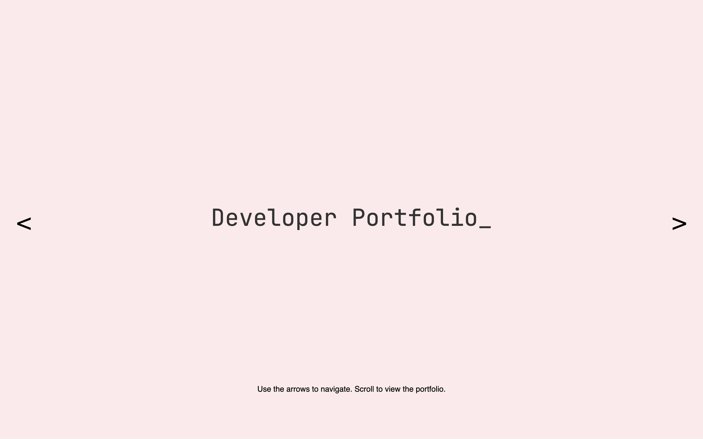
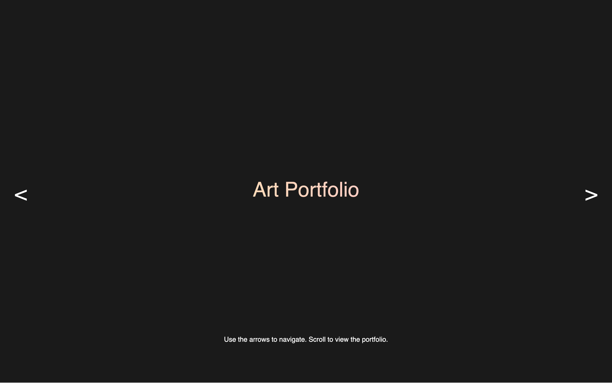
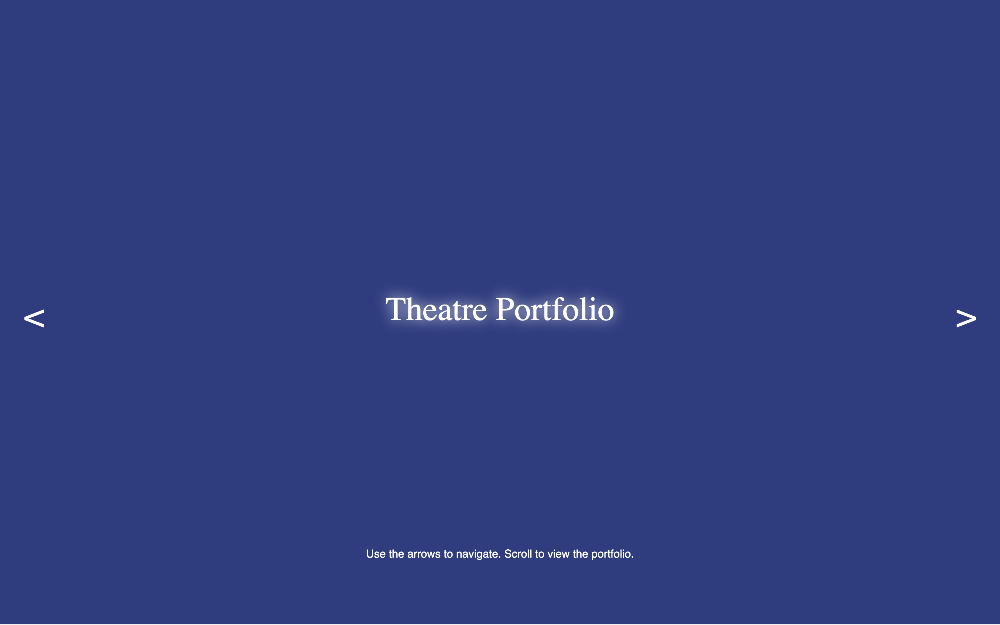
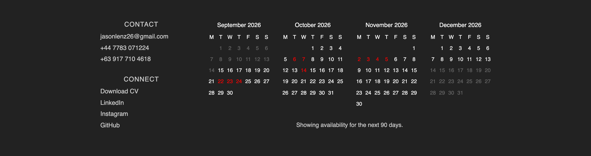
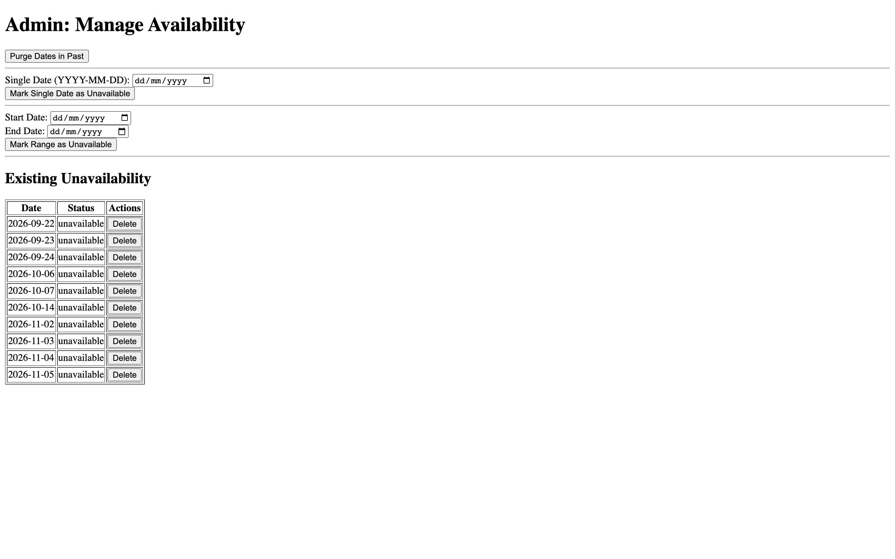

# CS50 Portfolio

**A three-panel portfolio site with a booking calendar that shows the next 90 days of availability.**

> [!WARNING]
> This is my CS50x final project from December 2024, archived as-is and unfinished. The
> carousel, the availability API and the admin page all work. The three portfolio panels
> are placeholder text, `/admin` has no login on it, and the purge button on that page
> does nothing. Read [Known issues](#known-issues) before you run it.

<p align="center">
  <a href="https://www.python.org"></a>
  <a href="https://flask.palletsprojects.com"></a>
  <a href="https://www.sqlite.org"></a>
  <a href="https://www.sqlalchemy.org"></a>
  <a href="https://getbootstrap.com"></a>
  <a href="LICENSE"></a>
</p>

| | |
|---|---|
| **Language** | Python 3.9 or later |
| **Framework** | Flask 3.1, Flask-SQLAlchemy 3.1 |
| **Database** | SQLite, created on first run |
| **Frontend** | Vanilla JavaScript, Bootstrap 5.3.2 from CDN |
| **Build step** | None |
| **License** | MIT |

---

## About

I wanted one site to cover the three things I do, so the landing page is a horizontal
carousel of three full-screen covers: developer, art, theatre. Arrows at the edges move
you between them. Their color flips between black and white depending on how bright the
cover behind them is, and so does the caption's.

The footer is the part I finished. It renders four months of calendar and shades out the
dates I'm not free, pulled live from a SQLite table over a small JSON API. There's a
separate `/admin` page where I mark dates unavailable, one at a time or as a range.

- Three-cover horizontal carousel driven by Bootstrap's carousel events, with the cover slide written by hand so it slides instead of fading through black
- Per-cover title treatments: a blinking terminal cursor, an animated gradient fill, a pulsing glow
- Contrast-aware arrows and caption text, picked with a YIQ luminance check against the live background color
- Four-month availability calendar in the footer, Monday-start, with a hover tooltip on unavailable days
- A JSON availability endpoint that only ever returns the next 90 days
- An admin page for marking single dates or date ranges unavailable, and deleting them again

## Tech stack

| Layer | Technology | Why it's here |
| :--- | :--- | :--- |
| Web framework | Flask 3.1 | Two template routes and two JSON routes. Nothing heavier was warranted. |
| ORM | Flask-SQLAlchemy 3.1 / SQLAlchemy 2.0 | One table, one model. I used it because CS50 had just taught it. |
| Database | SQLite | Created on first run at `instance/availability.db`. No server to install. |
| Templating | Jinja2 | Ships with Flask. The templates are static HTML, so it does almost nothing here. |
| CSS framework | Bootstrap 5.3.2 (CDN) | Only the carousel component. The rest of the styling is mine. |
| Frontend | Vanilla JavaScript | The calendar and the cover transitions are hand-rolled, no build step. |
| Fonts | JetBrains Mono (Google Fonts) | The monospace developer cover. |

## Screenshots



<sub>The first cover. The <code>_</code> after the title is a blinking cursor on a 1s cycle, caught here on a visible frame, and the arrows are black because the background is light.</sub>



<sub>One click of the right arrow. The cover slides in from the right, and the arrows and the caption flip to white because the YIQ check reads the new background as dark. The title is a gradient that sweeps across the text every 8 seconds.</sub>



<sub>Another click. The title glows in and out on a 2s alternating cycle, frozen here at full brightness. This one is meant to be set in Bitter, and isn't. See <a href="#known-issues">Known issues</a>.</sub>



<sub>The footer, scrolled into view. Red dates come back from <code>/availability_data</code> as unavailable, gray dates sit in the past or beyond the 90-day window, and white dates are open. Today is the 14th here, and it's gray when it shouldn't be. That's the timezone bug below, and I hit it while taking this shot.</sub>



<sub><code>/admin</code>, with no stylesheet on it at all. I never linked one. The table lists whatever the availability endpoint returns, which is why it can't show you anything in the past.</sub>

## Getting started

### Prerequisites

- Python 3.9 or later. I built this against 3.13 and re-ran it on 3.9.6 to write this README, and both work. Flask 3.1 drops support below 3.9.
- An internet connection at page load. Bootstrap and JetBrains Mono come from CDNs, and without them the carousel arrows stop working and the developer cover falls back to a system monospace.

You don't need Node. There's a `package.json` in the git history, but I deleted it before
the last commit and nothing in the project uses npm.

### Installation

```sh
git clone https://github.com/saturncity/misc-cs50-portfolio.git
cd misc-cs50-portfolio
python3 -m venv .venv
source .venv/bin/activate
pip install -r requirements.txt
```

There are no environment variables to set. The database path is hardcoded in `app.py`.

### Running

```sh
python app.py
```

That comes up on http://127.0.0.1:5000 with Flask's debug reloader on, because `debug=True`
is hardcoded in the `__main__` block. The public page is `/` and the admin page is
`/admin`. On first run it creates `instance/availability.db` with an empty table, so the
calendar will show every date as available until you go and mark some.

There are no tests. I never wrote any.

## Project structure

```
.
├── app.py                      # The whole backend. 4 routes, 1 model, ~60 lines.
├── requirements.txt            # Pinned, generated by pip freeze
├── DESIGN.md                   # Empty. CS50 wants a design doc and I never wrote it.
├── docs/
│   └── assets/                 # Screenshots for this README
├── static/
│   ├── assets/misc/cv.pdf      # Linked from the footer's Download CV button
│   ├── css/style.css           # All the styling for /, none for /admin
│   └── js/
│       ├── script.js           # Cover carousel, slide positioning, contrast inversion
│       └── footer_calendar.js  # Builds the four month grids from the availability API
└── templates/
    ├── index.html              # The public page
    └── admin.html              # Admin page, with its JavaScript inlined in a <script> tag
```

## Known issues

I found most of these while writing this README rather than back in 2024. It's archived,
so I'm documenting them rather than fixing them.

- **The "Purge Dates in Past" button can't delete anything.** It reads `/availability_data` to find past dates, but that endpoint filters to `date >= today` before it returns. The loop never gets a row, and the button still pops "purged successfully". I confirmed it by writing a 2024 date straight into the table: it stays in SQLite and never appears in the response. Past rows just accumulate where nothing can see them.
- **Today's cell grays out as if it were in the past.** `footer_calendar.js` builds each cell date with `Date.UTC(...)`, which is midnight UTC, then compares it against `new Date()`, which is local now. Once local time passes UTC midnight you're comparing today's midnight to a later instant, so today is "past". You can see it in the footer screenshot above.
- **The theatre title isn't in the font it asks for.** `.theatre-title` sets `font-family: 'Bitter', serif`, but the only `@import` in the stylesheet is JetBrains Mono. Bitter never loads and the browser falls back to a generic serif.
- **The three lower panels are placeholder text.** They carry `dev-content`, `art-content` and `theatre-content` classes that no CSS rule anywhere defines, so all three render identically in the same gray box. That's where the portfolio content was supposed to go.
- **`/admin` has no authentication.** Neither does `POST /update_availability`. Anyone who can reach the server can rewrite my calendar. Fine on localhost, and the reason this was never deployed.
- **Marking a date range drifts by a day west of UTC.** `addUnavailableRange` steps a UTC-parsed date with `setDate`, which works in local time, then formats it back with `toISOString`. At negative UTC offsets the round trip lands on the wrong day.
- **`Flask-WTF` and `WTForms` are in `requirements.txt` and never imported.** `pip freeze` caught them from something I abandoned.
- `script.js` registers a `transitionend` handler on every cover whose body is nothing but comments. It's leftover scaffolding.
- `app.py` calls `datetime.utcnow()`, which is deprecated from Python 3.12 on. It works, and it warns.

## Contributing

This is a coursework archive, so I'm not taking feature work on it. If you spot something
wrong in what's here, open an issue and I'll read it. If you want the calendar for your
own site, fork it and fix the timezone handling first.

## License

MIT. See [LICENSE](LICENSE).
